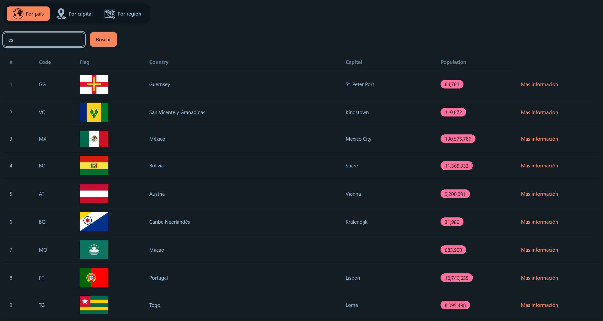

English | [Español](README.es.md)

# CountryApp

[](https://angular.dev/)
[](https://www.typescriptlang.org/)
[](https://tailwindcss.com/)
[](https://daisyui.com/)



<br>

This is a **learning and practice project** built with **Angular 21** that allows users to explore information about countries worldwide. This project focuses on API consumption, routing (child routes, parameters), and state persistence.

<br>

## Technical Highlights

- **Dynamic Search Engine:** Search countries by **Name, Capital, or Region** using the REST Countries API.
- **Routing:** Implementation of **Child Routes** and **Route Parameters** to display detailed country information.
- **State Persistence:** Search results and active tabs persist even after page reloads, ensuring a seamless navigation experience.
- **Reactive Search:** Optimized data fetching with specialized services to manage HTTP requests and error handling.

<br>

## Tech Stack

- **Angular 21**
- **TypeScript**
- **Tailwind CSS** & **DaisyUI**
- **REST Countries API**

<br>

## Installation

1. Clone the repository:

   ```bash
   git clone https://github.com/Antonio-Borrero/country-app-angular.git
   ```

2. Install dependencies:

   ```bash
   npm install
   ```

3. Run development server:

   ```
   ng serve
   ```

   - Go to `http://localhost:4200/`.
   - The app will automatically reload when any file is modified

<br>

## Project structure

```bash
    src/app/
    ├── country/
    │   ├── components/      # UI components (Country tables, search inputs, etc.)
    │   ├── interfaces/      # Type definitions for the REST Countries API
    │   ├── mappers/         # Data transformation logic (API to internal models)
    │   ├── pages/           # Main views and Routing Layouts
    │   │   ├── ...          # Specific search pages (Capital, Country, Region)
    │   │   └── layouts/     # Master layouts for the country module
    │   ├── services/        # Business logic and HTTP requests
    │   └── shared/          # Global UI elements (Footer, Home, 404)
    └── environments/        # Environment-specific configurations
```

<br>

## Learning outcomes

- Mastering Angular Router (parameters, redirection, and active links).
- Implementing search debouncing and persistence logic.
- Working with complex TypeScript interfaces from external APIs.
- Creating reusable UI components like customized tables and search bars.

<br>

## Build

To build the production version:

    ```bash
    ng build
    ```
